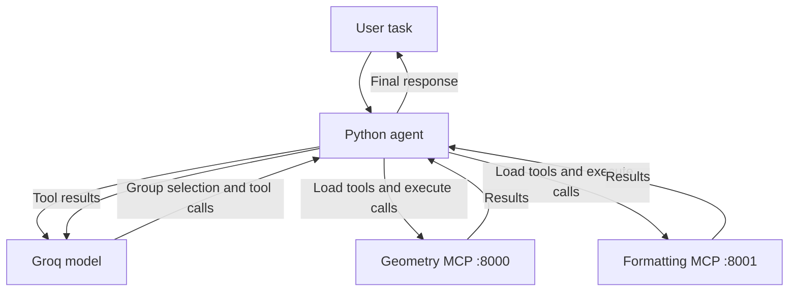

# Python MCP Agent

An educational Python project demonstrating an AI agent that discovers
and uses tools from multiple Model Context Protocol (MCP) servers.

The agent starts with a small group catalog and loads detailed tool
definitions only when needed.

## Features

- Two independent MCP servers: geometry and formatting.
- Dynamic tool discovery through MCP.
- Tool group selection by the language model.
- Tool execution and structured results.
- Multi-step tasks using results from previous calls.
- A limit of eight model requests per task.

## Architecture

The agent initially receives group descriptions and one application-side
tool: `load_tool_group`.

When a group is requested, the application connects to its MCP server,
retrieves its tools and adds them to the model's available tool list.

The Python application executes tool calls and sends their results back
to the model until it produces a final response or reaches the step limit.

Loaded groups remain available for the current task.

## Main files

| File | Purpose |
| --- | --- |
| `catalog.py` | Group descriptions, server addresses and group loader definition |
| `geometry_server.py` | Rectangle area and perimeter tools |
| `formatting_server.py` | Drawing title and author preparation |
| `group_agent.py` | Agent loop with dynamic group loading |

## Requirements

- Python 3.13 was used during development.
- A Groq API key.
- Access to the Groq API.

## Installation

Run these commands in Windows PowerShell:

```powershell
python -m venv .venv
.\.venv\Scripts\Activate.ps1
python -m pip install -r requirements.txt
Copy-Item .env.example .env
```

Open `.env` and replace the placeholder with your Groq API key.

## Running

Open three terminals in the project directory.
Activate `.venv` in each terminal.

Terminal 1 — geometry server:

```powershell
mcp run geometry_server.py --transport streamable-http
```

Terminal 2 — formatting server:

```powershell
python .\formatting_server.py
```

Terminal 3 — agent:

```powershell
python -u .\group_agent.py
```

The geometry server uses port 8000.
The formatting server uses port 8001.

The agent excludes localhost addresses from environment proxy routing
through `NO_PROXY`.

## Example tasks

```text
Calculate the perimeter of a rectangle with width 10 and height 5.
```

```text
Calculate the area of a rectangle with width 7 and height 3.
Then prepare a drawing title containing that area. Author: Tai.
```

Russian-language requests are also supported.

## Example execution

1. Load the geometry group.
2. Calculate rectangle area: 21.
3. Load the formatting group.
4. Prepare a title containing the calculated area.
5. Return a final response.

## Limitations

This is a learning prototype.

It does not connect to AutoCAD, create drawings or validate Russian
drafting standards. The formatting tool only prepares title data.

Tool selection is model-dependent. The example runs demonstrate the
workflow; they are not a comprehensive reliability benchmark.

Network failures can interrupt execution. If the agent asks a clarification
question, restart it with a more complete request.

## API key

Keep your real key in `.env`.
The repository includes only the `.env.example` template.

## Interaction diagram



The application starts with a brief group catalog. Detailed tool definitions
are loaded when the model requests a group through `load_tool_group`.
