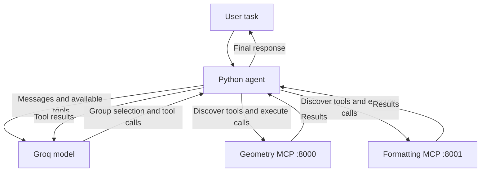

# Python MCP Agent

An educational Python project demonstrating an AI agent that discovers and uses tools from multiple Model Context Protocol (MCP) servers.

The agent starts with a small group catalog and loads detailed tool definitions only when needed.

## Features

- Two independent MCP servers: geometry and formatting.
- Dynamic tool discovery through MCP.
- Tool group selection by the language model.
- Tool execution and structured results.
- Multi-step tasks using results from previous calls.
- A limit of eight model requests per task.

## Architecture

The agent initially receives group descriptions and one application-side tool: `load_tool_group`.

When a group is requested, the application connects to its MCP server, retrieves its tools and adds them to the model's available tool list.

The Python application executes tool calls and sends their results back to the model until it produces a final response or reaches the step limit.

Loaded groups remain available for the current task.



## Main files

| File | Purpose |
| --- | --- |
| `catalog.py` | Group descriptions, server addresses and group loader definition |
| `geometry_server.py` | Rectangle area and perimeter tools |
| `formatting_server.py` | Drawing title and author preparation |
| `group_agent.py` | Agent loop with dynamic group loading |
| `requirements.txt` | Python dependencies |
| `.env.example` | API key configuration template |

## Requirements

- Python 3.13 was used during development.
- A Groq API key.
- Access to the Groq API.
- Ports 8000 and 8001 available locally.

The agent uses `openai/gpt-oss-20b` through the Groq API.

## Installation

Run these commands in Windows PowerShell from the project directory:

```powershell
python -m venv .venv
.\.venv\Scripts\Activate.ps1
python -m pip install -r requirements.txt
Copy-Item .env.example .env
```

Open `.env` and replace the placeholder with your Groq API key:

```dotenv
GROQ_API_KEY=your_groq_api_key_here
```

## Running

Open three terminals in the project directory and activate the virtual environment in each:

```powershell
.\.venv\Scripts\Activate.ps1
```

Terminal 1 — geometry server:

```powershell
mcp run geometry_server.py --transport streamable-http
```

Terminal 2 — formatting server:

```powershell
python .\formatting_server.py
```

Terminal 3 — agent:

```powershell
python -u .\group_agent.py
```

Enter a task when the agent displays `Задача:`.

The geometry server uses `http://127.0.0.1:8000/mcp`.
The formatting server uses `http://127.0.0.1:8001/mcp`.

Keep both servers running while using the agent. Use `Ctrl+C` in each server terminal to stop them.

The agent excludes localhost addresses from environment proxy routing through `NO_PROXY`.

## Example tasks

Calculate a perimeter:

```text
Посчитай периметр прямоугольника шириной 10 и высотой 5.
```

Prepare title data:

```text
Подготовь надпись для чертежа «План комнаты», автор Тай.
```

Complete a task using both tool groups:

```text
Посчитай площадь прямоугольника шириной 7 и высотой 3.
Затем подготовь надпись с полученной площадью в названии, автор Тай.
```

English-language requests can also be entered:

```text
Calculate the area of a rectangle with width 7 and height 3.
Then prepare a drawing title containing that area. Author: Tai.
```

## Recorded example

User request:

```text
Посчитай площадь прямоугольника шириной 7 и высотой 3.
Затем подготовь надпись с полученной площадью в названии, автор Тай.
```

Observed tool calls:

| Step | Tool | Arguments | Result |
| --- | --- | --- | --- |
| 1 | `load_tool_group` | `{"group": "geometry"}` | Geometry tools loaded |
| 2 | `geometry__rectangle_area` | `{"height": 3, "width": 7}` | `{"ok": true, "area": 21.0, "error": null}` |
| 3 | `load_tool_group` | `{"group": "formatting"}` | Formatting tools loaded |
| 4 | `formatting__prepare_title` | `{"author": "Тай", "title": "Площадь прямоугольника 21"}` | Title data prepared |

On the fifth model request, the agent returned:

> Площадь прямоугольника: 21  
> Заготовка надписи:
>
> - **Тема:** Площадь прямоугольника 21
> - **Автор:** Тай

This sequence was recorded during a local run. Tool selection and wording may vary between runs.

## Limitations

This is a learning prototype.

- It does not connect to AutoCAD, create drawings or validate Russian drafting standards.
- The formatting tool only prepares title data.
- Each agent run handles one task; conversation history is not retained between runs.
- If the agent asks a clarification question, restart it with a more complete request.
- Loaded tool groups remain available until the current run ends.
- Network failures can interrupt execution.
- Tool selection is model-dependent. The recorded examples are not a comprehensive reliability benchmark.
- Reaching the eight-request limit can leave a task unfinished.

## API key

Keep your real key in `.env`. The repository includes only the `.env.example` template.

Do not commit `.env`; it is excluded through `.gitignore`.
